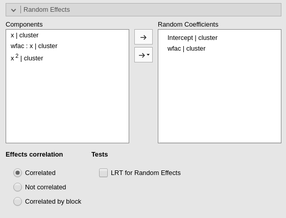
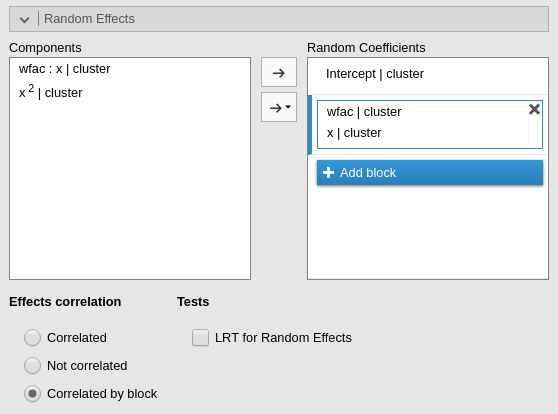
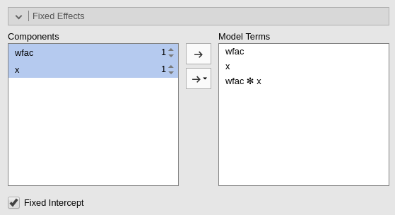
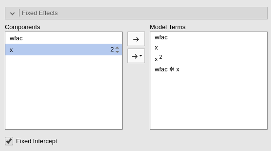
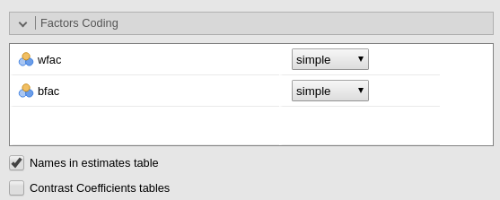

```{r echo=FALSE,results='hide'}
source("../R/functions.R")
```

`r version("1.5.0")` 


**Mixed Linear Models** module of the GAMLj suite for jamovi


The module estimates a mixed linear model with categorial and/or continuous variables, with options to facilitate estimation of interactions, simple slopes, simple effects, post-hoc, etc. In this page you can find some hint to get started with the mixed models module. For more information about how to module works, please check the [technical details](mixed_specs.html)
 

# Module
The module can estimates REML and ML linear mixed models for any combination of categorical and continuous variables, thus providing an easy way of obtaining multilevel or hierarchical linear models for any combination of independent variables types.

# Estimates
The module provides a parameter estimates of the fixed effects, the random variances and correlation among random coefficients.

Variables definition follows jamovi standards, with categorical independent variables defined in "fixed factors" and continuous independent variables in "covariates".


The grouping variable is simply set by putting the corresponding variable(s) into `cluster`. In this version, multiple clustering variables are possible, but not combinations of classifications ( see [Technical Details](mixed_specs.html) ). 

Confidence intervals for the parameters estimates and  REML or ML can be chosen.

The actual estimation occurs when the dependent variable, the clustering variable and at least one random coefficient (random effect) has been selected.

# Random effects



Random effects across clustering variables are automatically prepared by the module following R lmer() standards: `term | cluster` indicates that the coefficient associated with `term` is random across `cluster`. 

By default the module assumes correlated random effects. A variance component model can be estimated by selecting `Not correlated` value in the `Effects correlation` option. More complex random components structures can be defined selecting `Correlated by block`. 



After selecting `Correlated by block` one can specify any number of blocks and fill them with different random effects. Effects in the same block will be correlated in the model, effects in different blocks will not be correlated. In the example, for instance, there are two blocks, one with the `Intercept` and the other one with `wfac | cluster` and `x | cluster`. The resulting model will set  `wfac` and `x` effects as correlated, but not correlated with the intercept. That is, the resulting random component is:

` ~ ( 1 | cluster )+( 0+wfac + x | cluster )`

Random effects in the same block should have the same clustering variable.


The option `LRT for random effects` produces a table of *Likelihood Ratio Tests* for the random effects. The table is estimated with `lmerTest::ranova` command, documented [here](https://cran.r-project.org/web/packages/lmerTest/lmerTest.pdf). The test basically compares the likelihood of a model with the `effect` included versus a model with the `effect` excluded. For example, `x in (1+x|cluster)` means that the model with `(1+x|cluster)` random structure is compared with a model with `1|cluster)` random structure. If significant, the model with random effect `x` is significantly  better (in terms of likelihood) than the model with `(1|cluster)` structure.

# Fixed effects Model 



By default, the model fixed effects terms are filled in automatically for main effects and for interactions with categorical variables. 

Interactions between continuous variables or categorical and continuous can be set by clicking the second arrow icon.

For continuous variables, higher order effects can be defined by selecting the variable in the `Component` field, clicking the order number on the right (default=1), and then dragging the variable on the `Model Terms` field.



Higher order terms should be defined before interactions involving the variable in the higher order term.

The option `Fixed Intercept` includes an intercept in the model. Unflag it to estimate zero-intercept models.

# Factors coding



```{Call_child, child='commons/factorCoding_chunk.Rmd'}
```

More details and examples `r link_pages("ros_contrasts")`.


# Covariates Scaling


Continuous variables can be centered, standardized, cluster-based centered, cluster-based standardized or used as they are (`none`). The default is `centered` because it makes our lives much easier when there are interactions in the model, and do not affect the B coefficients when there are none. Thus, if one is comparing results with other software that does not center the continuous variables, without interactions in the model one would find only a discrepancy in the intercept, because in GAMLj the intercept represents the expected value of the dependent variable for the average value of the independent variable. If one needs to _unscale_ the variable, simple select `none`.

 `cluster-based centered` and `cluster-based standardized` center each score using the mean of the cluster in which the score belongs. For `cluster-based standardized` the score is also divided by the cluster standard deviation.


```{Call_child, child='commons/covariateScaling_chunk.Rmd'}
```

# Post-hocs


```{Call_child, child='commons/posthoc_chunk.Rmd'}
```


# Plots


```{Call_child, child='commons/plots_chunk.Rmd'}
```

By flagging `Random effects` one obtains the random effects estimated values in the plot along with the fixed effects. 

# Estimated marginal means


```{Call_child, child='commons/emm_chunk.Rmd'}
```


# More info

* [Technical Details](mixed_specs.html)

# Examples

Some worked out examples of the analyses carried out with jamovi GAMLj Mixed models are posted here (more to come)

`r include_examples("mixed")`
